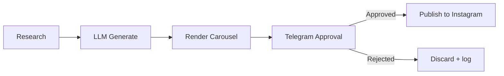

# SentinelPress

A multi-tenant AI content automation engine: it researches trustworthy sources, drafts Instagram content (script, carousel, caption, hashtags), renders carousel images, sends everything to you on Telegram for a tap-to-approve/reject decision, and only then publishes via the official Instagram Graph API.

Built to run entirely on free infrastructure — GitHub Actions for scheduled/triggered compute, the git repo itself as the database, Cloudflare Workers for the one always-on piece (catching Telegram approvals). No server to keep running, no hosting bill.

**Status:** Milestones 0–11 complete. See `SETUP.md` for what to configure, and the roadmap below for what's next.

## How it works



## Project structure

```
accounts/<accountId>/config.json    Per-account settings, sources, brand
accounts/<accountId>/history.json   Dedupe store (which articles already used)
accounts/<accountId>/prompts/       LLM prompt templates for this account
accounts/_template/                 Copy this to add a new account
scripts/                            The engine — account-agnostic
data/<accountId>/queue/             pending/ -> approved/ -> published/
.github/workflows/                  Scheduled + event-triggered pipelines
```

## Roadmap

- [x] Milestone 0 — Instagram Graph API access set up
- [x] Milestone 1 — Repo scaffold, config schema, multi-tenant structure
- [x] Milestone 2 — Research + dedupe engine (RSS -> candidate JSON)
- [x] Milestone 3 — LLM content generation (Gemini/Groq)
- [x] Milestone 4 — Carousel image renderer
- [x] Milestone 5 — Telegram notifier
- [x] Milestone 6 — Cloudflare Worker webhook + approve/reject buttons
- [x] Milestone 4b — Real photo per slide (Pexels, matched to each slide's mood), with a procedural gradient background as automatic fallback when a photo isn't available. On-image credit (not in caption) satisfies Pexels' API attribution terms without cluttering the post.
- [x] Milestone 7 — Instagram publish agent
- [x] Milestone 8 — Reel video assembly (ffmpeg: pans/zooms/crossfades from slides)
- [x] Milestone 9 — Reel voiceover (Piper TTS) + music, reels wired into Telegram approval + Instagram publish
- [x] Milestone 10 — Analytics agent + weekly summary
- [x] Milestone 11 — Hardening: retries, error alerts, docs
- [x] Milestone 12 — Add The English Vault as a second account (topic-bank content source, new engine capability for non-news accounts)

## Troubleshooting

**A step failed and I got a 🚨 Telegram alert — now what?**
Check the **Actions** tab for that workflow run; the alert includes the failing script's name and the first 500 characters of the error, but the full log (including any retry attempts leading up to it) is in the run itself.

**"No pending post found with approvalHash..." in the Handle Approval log.**
Not a bug — this means the tap was already processed (Telegram retries webhook delivery on any non-2xx response, so a duplicate delivery is expected occasionally) or the post was somehow already moved. Safe to ignore if it only happens occasionally.

**A script failed with a JSON parse error on `history.json`.**
`loadHistory()` catches this and falls back to empty history rather than crashing — check the warning log for which account's file is corrupted, then fix it manually on GitHub (valid shape: `{"processedUrls": [], "lastUpdated": null}`).

**Gemini/Groq/Telegram/Instagram calls failing intermittently.**
These now retry automatically (exponential backoff, up to 3 attempts) for transient failures — network errors, 429 rate limits, 5xx server errors. A call that fails immediately without retrying means the error was classified as non-transient (e.g. a genuine 401/403 auth problem, or bad request parameters) — check the error message for what's actually wrong rather than assuming it'll resolve itself.

**ffmpeg / Piper not found.**
Both are installed fresh in each workflow run (`apt-get install ffmpeg`, `pip install piper-tts`) rather than assumed pre-installed — if either step is missing from a workflow you're editing, that's why a later step would fail with an ENOENT-style error.

**No Telegram alert arrived for a failed step.**
`TELEGRAM_BOT_TOKEN`/`TELEGRAM_CHAT_ID` need to be set at the **job level** (not just on individual steps) for `alertFailure()` to reach them regardless of which step fails — this is already how `daily-pipeline.yml` and `handle-approval.yml` are set up; keep that pattern if you add new steps.

**Tapping Approve/Reject does nothing, and nothing posts to Instagram.**
Since the Cloudflare Worker runs outside this repo, I can't see its logs directly — work through this in order, it'll be one of these:

1. **Is a "Handle Approval" run appearing in the Actions tab at all after you tap a button?**
   - **No run appears** → the problem is between Telegram and the Worker, or the Worker and GitHub. Run `wrangler tail` in the `cloudflare-worker/` folder, then tap a button — this streams the Worker's live logs and will show exactly what happened (or didn't).
   - **A run appears but fails** → open it and read the failing step's log directly; skip to the specific error.
2. **Check the webhook is actually registered:** `curl https://api.telegram.org/bot<TOKEN>/getWebhookInfo` — confirm `url` matches your deployed Worker's URL, and check `last_error_message` for clues if it's non-empty.
3. **Check your GitHub PAT hasn't expired or lost permission** — fine-grained PATs expire on the date you set (commonly 90 days). Settings → Developer settings → Personal access tokens → confirm it's still active with **Contents: Read and write** on this repo. If expired, generate a new one and `wrangler secret put GITHUB_PAT` again.
4. **Check `main` doesn't have a branch-protection rule requiring PRs** — Settings → Rules → Rulesets on this repo. This exact issue broke direct pushes on the other website repo earlier; if a similar rule exists here, `git push` in the commit steps will fail outright. Either remove the rule or add a bypass for `github-actions`.
5. **Double check the Worker's 4 secrets are all set correctly**: `wrangler secret list` shows names but not values — if you're unsure a value is right, `wrangler secret put <NAME>` again to overwrite it.


## License

Private project — no license granted for reuse.
