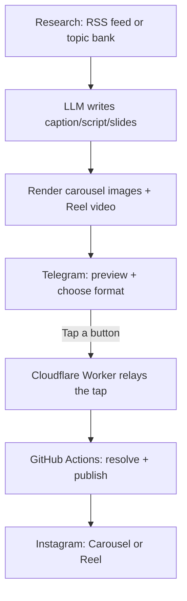

# SentinelPress

An AI content automation engine that researches sources, drafts Instagram content (carousel + Reel with voiceover), sends it to you on Telegram for a one-tap review, and publishes only what you approve. Runs entirely on free infrastructure — no server to keep running, no hosting bill.

Currently powers two accounts: **CyberShieldAlerts** (cybersecurity/DevOps/tech news) and **The English Vault** (English lessons with Hindi translations).

---

## Table of Contents

1. [How it works](#how-it-works)
2. [External services this project uses — and exactly how to set each one up](#external-services)
3. [Repository structure](#repository-structure)
4. [Local testing](#local-testing)
5. [Adding a new account](#adding-a-new-account)
6. [Troubleshooting](#troubleshooting)

---

## How it works



Everything runs on **GitHub Actions** (scheduled once a day, and event-triggered when you tap a Telegram button) except one piece: a small **Cloudflare Worker** that's the only thing that needs to be always-on, since it has to catch your button tap the instant it happens. The git repo itself is the database — every post's status lives as a JSON file under `data/`, moving through `pending/ → approved/ → published/` as it goes.

---

## External Services

This project depends on 7 external services. All have free tiers sufficient for daily use at this scale — nothing here requires a paid plan. Set these up in this order, since later ones depend on earlier ones.

### 1. GitHub — hosts the code and runs the pipeline

You're already here if you're reading this in the repo. Two things to configure:

1. **Settings → Actions → General → Workflow permissions** → set to **"Read and write permissions"**. Without this, the pipeline can't commit its own output (rendered images, updated queue state) back to the repo.
2. **Settings → Secrets and variables → Actions** — this is where every API key and token below gets stored (never in code files). Add secrets via **New repository secret** as you collect them in the steps below.

If you ever see a workflow fail with a `git push` rejection, check **Settings → Rules → Rulesets** — a "require pull request" rule on `main` will block the pipeline's automated commits. Either remove it or add a bypass for `github-actions`.

---

### 2. Instagram Graph API — publishes your posts

This is the most involved setup, done once per Instagram account (repeat all of section 2 for each additional account, reusing the same Meta Developer App from step 2c onward).

**2a. Convert the Instagram account to Business**
Instagram app → your profile → **Settings → Account type and tools → Switch to professional account** → choose **Business**.

**2b. Create a Facebook Page and link it**
If you don't already have one: facebook.com/pages/create → any name is fine, it just needs to exist as a linking anchor. During the Business account setup in step 2a, connect this Page when prompted.

**2c. Create a Meta Developer App** *(only needed once — reuse for additional accounts)*
1. developers.facebook.com/apps → **Create App** → type **Business** → give it any name.
2. On the app dashboard, scroll down (no "Add Product" button on the current UI — look for a tile) until you see **Instagram** → click **Set up**.
3. Choose **API setup with Facebook login** (not "with Instagram login" — that variant is for consumer apps without a linked Page, and won't support publishing the way we need).
4. Under **"1. Add required permissions"**, click **Add required content permissions**. This adds `instagram_basic`, `instagram_content_publishing`, `pages_read_engagement`, `business_management`, `pages_show_list`. Skip the "Send messages" section entirely — not needed for publishing.

**2d. Add your Instagram account as a Tester**
1. App dashboard → **Roles** → **Instagram Testers** tab → **Add Instagram Testers** → enter the account's exact username.
2. Log into Instagram as that account → **Settings → Apps and Websites** (or wherever tester invites show up) → accept the pending invite from your app.
3. Skipping this step causes an "Insufficient Developer Role" error when you try to generate a token.

**2e. Generate the access token**
1. Back in your app, go to **API setup with Facebook login** (in the left sidebar) → scroll to **"2. Generate access tokens"** → **Add account**.
2. Log in with Facebook, select the linked Page, authorize the Instagram account.
3. This generates a **long-lived access token** (~60 days) right there on the page.

**2f. Get the Instagram Business Account ID**
Open this URL in a browser, with the token from step 2e:
```
https://graph.instagram.com/v21.0/me?fields=id,username,account_type&access_token=YOUR_TOKEN
```
The `id` field in the response is what you need.

**2g. Add the secrets to GitHub**
Each account needs its own pair, named to match its `config.json` (see [Adding a new account](#adding-a-new-account)):

| Secret name | Value |
|---|---|
| `CYBERSHIELDALERTS_IG_ACCESS_TOKEN` | Token from step 2e |
| `CYBERSHIELDALERTS_IG_BUSINESS_ID` | ID from step 2f |
| `ENGLISHVAULT_IG_ACCESS_TOKEN` | Same steps, for the English Vault account |
| `ENGLISHVAULT_IG_BUSINESS_ID` | Same steps, for the English Vault account |

**A genuine uncertainty worth knowing:** Meta's own docs currently show two different hosts/versions for these API calls (`graph.facebook.com` v21.0 vs. the newer `graph.instagram.com` v25.0). This project defaults to `graph.facebook.com`/`v21.0`, matching the Facebook Login flow used above. If publishing fails with a version-shaped error, add two override secrets: `GRAPH_API_HOST` = `graph.instagram.com` and `GRAPH_API_VERSION` = `v25.0`. No code changes needed — these are read as environment variable overrides.

---

### 3. Telegram Bot — where you approve or reject each post

1. In Telegram, message **@BotFather** → `/newbot` → follow the prompts → it gives you a token immediately.
2. Search for your new bot's username → tap **Start** (required — a bot can't message you until you've messaged it first).
3. Search for **@userinfobot** → tap **Start** → it replies with your account info including `Id: 123456789` — that's your chat ID.
4. Add secrets: `TELEGRAM_BOT_TOKEN` and `TELEGRAM_CHAT_ID`. Both accounts share the same bot/chat — you'll see approval messages for each, distinguishable by the account handle shown in the post itself.

---

### 4. Cloudflare Worker — the only always-on piece

This is what catches your Telegram button tap and relays it to GitHub. Deployed separately from the rest of the repo.

**4a. Create a free Cloudflare account**
dash.cloudflare.com/sign-up — no credit card needed for what we're doing.

**4b. Create a GitHub Personal Access Token for the Worker to use**
This is separate from `GITHUB_TOKEN` (which only works *inside* Actions, not from an external caller).
1. GitHub → your profile picture → **Settings → Developer settings → Personal access tokens → Fine-grained tokens → Generate new token**.
2. Repository access: **Only select repositories** → this repo.
3. Permissions → **Repository permissions** → **Contents: Read and write**.
4. Generate, copy the token immediately (starts with `github_pat_...`) — shown only once.

**4c. Deploy the Worker**
```bash
cd cloudflare-worker
npm install -g wrangler
wrangler login
wrangler deploy
```
This prints a URL like `https://sentinelpress-telegram-webhook.<your-subdomain>.workers.dev` — save it.

**4d. Set the Worker's secrets** (each command prompts for the value, keeping it out of shell history)
```bash
wrangler secret put TELEGRAM_BOT_TOKEN      # same token from section 3
wrangler secret put TELEGRAM_WEBHOOK_SECRET # make up any random string, e.g. `openssl rand -hex 32`
wrangler secret put GITHUB_PAT              # token from step 4b
wrangler secret put GITHUB_REPO             # e.g. YourOrg/SentinelPress
```

**4e. Point Telegram at the Worker**
```bash
curl -X POST "https://api.telegram.org/bot<YOUR_BOT_TOKEN>/setWebhook" -H "Content-Type: application/json" -d "{\"url\": \"<YOUR_WORKER_URL>\", \"secret_token\": \"<SAME_RANDOM_STRING_FROM_4d>\"}"
```
A `{"ok":true,...}` response confirms success.

**Whenever you (or I) change `cloudflare-worker/src/index.mjs`, you must run `wrangler deploy` again** — pulling the updated code into the repo does not update the live Worker. This is the single most common cause of "I tapped the button and nothing happened."

---

### 5. Google Gemini API — primary LLM (captions, scripts, carousel text)

1. ai.google.dev → sign in → **Get API key** → **Create API key**. No credit card required for the free tier.
2. Add secret: `GEMINI_API_KEY`.

### 6. Groq API — automatic fallback LLM (optional but recommended)

If Gemini fails or its key is missing, the pipeline automatically retries with Groq instead of failing the whole run.

1. console.groq.com → sign up (free) → **API Keys → Create API Key**.
2. Add secret: `GROQ_API_KEY`.

### 7. Pexels API — real stock photos for carousel slides (optional)

1. pexels.com/api → sign up → key is issued instantly, no card.
2. Add secret: `PEXELS_API_KEY`.

### 8. Puter.js — high-quality AI illustrations (optional, recommended)

A real quality upgrade over the old Pollinations-only fallback — gives access to production models (FLUX, GPT Image, Imagen 4, Stable Diffusion 3) for free through a Puter account.

1. Sign up at puter.com (free).
2. puter.com/dashboard → **Create token**.
3. Add secret: `PUTER_AUTH_TOKEN`.

**Real uncertainty worth knowing:** Puter's free-tier rate limits aren't clearly documented anywhere I could find. If it starts failing consistently, that's likely why — the fallback chain (photo → Puter.js → Pollinations → procedural gradient) means posts still render fine either way.

If `PEXELS_API_KEY` and `PUTER_AUTH_TOKEN` are both unset, or a search/generation comes back empty, slides automatically fall back to Pollinations.ai (no signup needed at all) and finally to a procedurally-generated gradient background. You always get *something* visually rich — never a blank slide.

---

### Things that need zero setup

- **ffmpeg** (assembles the Reel video) and **Piper TTS** (generates the voiceover, fully offline) are installed fresh inside each workflow run — no account, no key, nothing to configure.
- **Pollinations.ai** (AI illustration fallback) — no signup, called automatically when needed.

---

## Repository Structure

```
accounts/<accountId>/config.json    Per-account settings: sources, brand colors, IG handle
accounts/<accountId>/topics.json    Curriculum bank (for non-news accounts like English Vault)
accounts/<accountId>/history.json   Dedupe store — which articles/topics already used
accounts/<accountId>/prompts/       LLM prompt templates specific to this account
accounts/_template/                 Copy this to add a new account
scripts/                            The engine — account-agnostic, reads config to know what to do
templates/carousel/                 Slide layout logic (title/body/comparison/cta) + mood backgrounds
cloudflare-worker/                  The one always-on piece — deployed separately, see section 4
data/<accountId>/queue/             pending/ -> approved/ -> published/ (or rejected/)
.github/workflows/                  Scheduled + event-triggered pipelines
```

## Local Testing

```bash
npm ci
npm run research          # fetch RSS or pick a topic
npm run generate          # LLM writes caption/script/slides
npm run render             # carousel PNGs
npm run render-reel        # Reel video (needs ffmpeg installed locally to test)
npm run render-voiceover   # TTS + music (needs Piper installed locally: pip install piper-tts)
npm run notify              # sends to Telegram for approval
```

Each step reads/writes `data/<accountId>/queue/pending/` — inspect the JSON and images directly to see exactly what the pipeline produced before it goes to Telegram.

## Adding a New Account

1. Copy `accounts/_template/config.example.json` to `accounts/<new-account>/config.json`. Fill in `accountId`, `displayName`, and — importantly — **`instagramHandle`** (the real `@handle`, which may differ from the internal `accountId` folder name).
2. Either add real RSS `sources`, or set `"topicBank": "topics.json"` and create that file (copy `accounts/englishvault/topics.json` as a shape reference) for curriculum-style content instead of news.
3. Add prompt files under `accounts/<new-account>/prompts/` (`caption.txt`, `script.txt`, `carousel.txt`, `hashtags.txt`).
4. Set `"active": true`.
5. Follow section 2 above again for this account's Instagram, and add its two secrets.

No engine code changes needed — `loadActiveAccounts()` and `research.mjs`'s RSS/topic-bank branch pick up any account automatically.

## Troubleshooting

**Tapping Approve/Reject does nothing, nothing posts to Instagram.**
1. Did you `wrangler deploy` after the Worker code last changed? (See the note at the end of section 4.)
2. Check the **Actions** tab — does a "Handle Approval" run appear at all after tapping? If not, run `wrangler tail` in `cloudflare-worker/` while tapping to see the Worker's live logs.
3. `curl https://api.telegram.org/bot<TOKEN>/getWebhookInfo` — confirm `url` matches your deployed Worker and check `last_error_message`.
4. Check your GitHub PAT (step 4b) hasn't expired.
5. Check for a branch-protection rule blocking direct pushes to `main` (Settings → Rules).

**A script failed with a JSON parse error on `history.json`.**
It self-heals — `loadHistory()` catches this, logs a warning, and falls back to empty history rather than crashing. Fix the file manually if you want dedupe history back (valid shape: `{"processedUrls": [], "lastUpdated": null}`).

**Gemini/Groq/Telegram/Instagram calls failing intermittently.**
These retry automatically (exponential backoff) for transient failures — network errors, 429s, 5xx errors. An immediate failure with no retry means it was classified as non-transient (e.g. a real auth problem) — read the actual error message.

**No Telegram alert arrived for a failed step.**
`TELEGRAM_BOT_TOKEN`/`TELEGRAM_CHAT_ID` must be set at the **job level** in the workflow YAML (not just on one step) for failure alerts to reach you regardless of which step fails.

**ffmpeg / Piper "command not found".**
Both are installed fresh in each workflow run rather than assumed pre-installed. If you added a new workflow step that needs either, make sure the corresponding install step (`apt-get install ffmpeg` / `pip install piper-tts`) runs before it.

---

## Hindi/Hinglish reels (The English Vault)

English Vault's reels now follow a Hindi-explainer-Reel format (hook naming a common confusion → quick Hinglish breakdown → relatable example → comment-bait CTA), with genuine Hindi voiceover via **Edge TTS** — Microsoft's free online neural voice service, called over the network (no local model, no GPU).

**Why not Svara-TTS** (a genuinely excellent open Indic TTS model, considered and researched in depth): every deployment path for it — the standard FP8 variant, the MLX port — explicitly requires a CUDA GPU (6-8GB VRAM even in the "efficient" configuration) or Apple Silicon. GitHub Actions' free runners have neither. Edge TTS trades a bit of voice-cloning flexibility for something that actually runs on free CPU-only infrastructure today, and as a bonus its `--write-subtitles` output gives real per-phrase timing for captions — more accurate than the word-count estimate Piper's output requires.

**Caption font also switches per account**: Hind (Devanagari-capable) for edge-tts accounts, Poppins for Piper/English-only accounts — verified directly in ffmpeg's `drawtext` filter, which is a different rendering engine than the carousel slides' Satori-based text and needed its own check.

## Post formats

Both accounts now use a single-image "page/news card" format (not a multi-slide carousel): a centered account badge, a two-tone headline (key entity/word highlighted in the accent color), a divider, a summary paragraph, and a Hindi one-liner — faster to render than a multi-slide carousel and matches proven high-engagement layouts. The Reel version still gets full Ken Burns motion and burned-in captions; with only one image there's no crossfade needed, so it's just one continuous zoom for the whole duration.

**The English Vault's weekly content plan** (`accounts/englishvault/topics.json`'s `weekday` field drives this automatically — `research.mjs` prefers today's themed topics before falling back to the general pool):

| Day | Theme |
|---|---|
| Monday | Word of the Day (Vocabulary) |
| Tuesday | Translation (Hindi ↔ English) |
| Wednesday | Grammar Tip |
| Thursday | Daily Conversation |
| Friday | Idiom or Phrasal Verb |
| Saturday | Vocabulary Quiz |
| Sunday | Common Mistakes & Corrections |

38 topics currently in the bank, covering all 7 themes (this is a representative starting set, not the full 100 headline ideas — easy to extend by adding more entries to `topics.json` with the same shape, each new one automatically enters the rotation).

Both the single-image and multi-image cases are fully supported end-to-end regardless: Telegram correctly switches between `sendPhoto` (one image) and `sendMediaGroup` (multiple), and Instagram publishing correctly switches between a plain `IMAGE` post and a `CAROUSEL` post based on actual image count.

## Watch time optimization

Instagram's own ranking signals (confirmed by Adam Mosseri) prioritize watch time, completion rate, and rewatches above almost everything else — and captions are an explicit ranking factor since most viewers watch muted. Reels now include:

- **Burned-in captions**, timed to the narration and positioned above the slide's own footer so nothing overlaps. Escaping for ffmpeg's `drawtext` filter was tested directly against apostrophes, colons, and commas (the characters most likely to break a naive implementation) before shipping.
- **Ken Burns motion** on every slide (already existed) — static slideshows perform worse than content with continuous movement.
- **Original content only** — no reposts, which Instagram's 2026 ranking explicitly rewards (40-60% more distribution) over aggregated content.

Deliberately NOT implemented, since they violate Instagram's policies and risk account suppression: engagement pods, follow/unfollow schemes, purchased views/likes, or engagement-bait captions ("like if you agree"). These are excluded on purpose, not by oversight.

## Status

All 12 original milestones complete: research -> LLM generation -> carousel + Reel rendering (photos, AI illustrations, or procedural art, always with a fallback) -> Telegram approval (choose Carousel or Reel, never both) -> Instagram publishing -> weekly analytics -> retry/alerting hardening -> a second account (The English Vault, with Hindi-translation support) running through the same account-agnostic engine.
