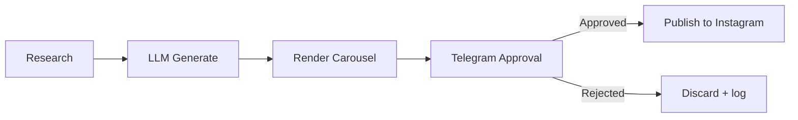

# SentinelPress

A multi-tenant AI content automation engine: it researches trustworthy sources, drafts Instagram content (script, carousel, caption, hashtags), renders carousel images, sends everything to you on Telegram for a tap-to-approve/reject decision, and only then publishes via the official Instagram Graph API.

Built to run entirely on free infrastructure — GitHub Actions for scheduled/triggered compute, the git repo itself as the database, Cloudflare Workers for the one always-on piece (catching Telegram approvals). No server to keep running, no hosting bill.

**Status:** Milestone 1 (scaffold) complete. See `SETUP.md` for what to configure, and the roadmap below for what's next.

## How it works



## Project structure

```
accounts/<accountId>/config.json    Per-account settings, sources, brand
accounts/<accountId>/history.json   Dedupe store (which articles already used)
accounts/<accountId>/prompts/       LLM prompt templates for this account
accounts/_template/                 Copy this to add a new account
scripts/                            The engine — account-agnostic
data/<accountId>/queue/             pending/ -> approved/ -> published/
.github/workflows/                  Scheduled + event-triggered pipelines
```

## Roadmap

- [x] Milestone 0 — Instagram Graph API access set up
- [x] Milestone 1 — Repo scaffold, config schema, multi-tenant structure
- [x] Milestone 2 — Research + dedupe engine (RSS -> candidate JSON)
- [x] Milestone 3 — LLM content generation (Gemini/Groq)
- [x] Milestone 4 — Carousel image renderer
- [x] Milestone 5 — Telegram notifier
- [x] Milestone 6 — Cloudflare Worker webhook + approve/reject buttons
- [x] Milestone 4b — Real topic photos on title slides (Pexels, free tier)
- [x] Milestone 7 — Instagram publish agent
- [x] Milestone 8 — Reel video assembly (ffmpeg: pans/zooms/crossfades from slides)
- [ ] Milestone 9 — Reel voiceover (Piper TTS) + music, then wire reels into Telegram approval + Instagram publish
- [ ] Milestone 10 — Analytics agent + weekly summary
- [ ] Milestone 11 — Hardening: retries, error alerts, docs
- [ ] Milestone 12 — Add The English Vault as a second account

## License

Private project — no license granted for reuse.
